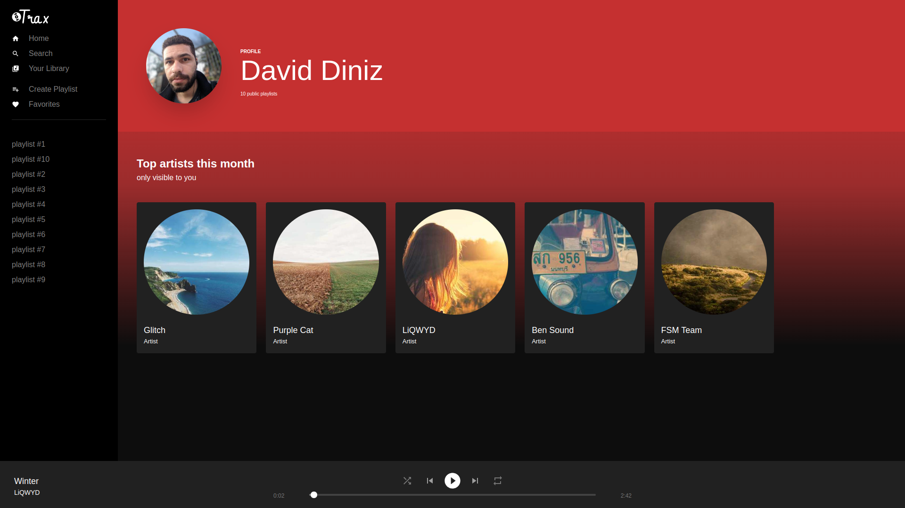
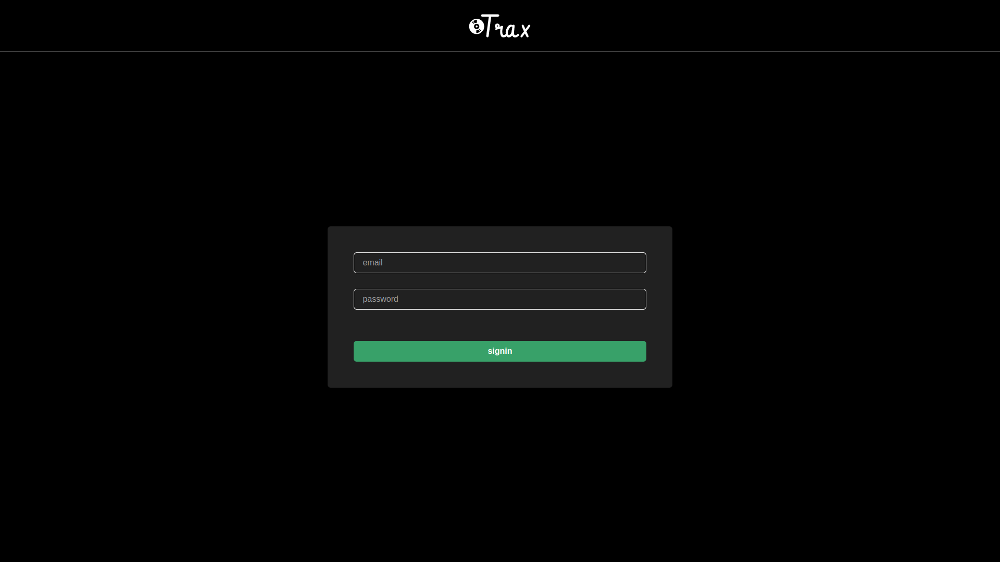
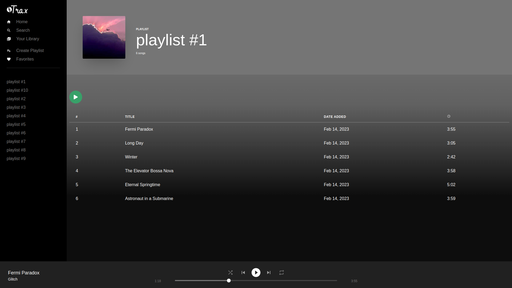

# Spotify clone





## Getting Started

These instructions will get you a copy of the full project up and running on your local machine for development and testing purposes.

The project can be built with npm.

* **Npm** is distributed with Node.js which means that when you download Node.js, you automatically get npm installed on your computer. [Download Node.js](https://nodejs.org/en/download/)

## Setting up Database

The project uses [PostgreSQL](https://www.postgresql.org).

I recommend use [Docker](https://www.docker.com) to install and run the database.

## How to run

* To download the project follow the instructions bellow:

```
1. git clone https://github.com/DavidWDiniz/spotify-clone.git
2. cd spotify-clone
```

* Install the dependencies:

```
npm install
```
* Rename the file `.env.example` to `.env` and create yours environment variables and replace them. It's is very important for running the server.


* Run database migration and seed:

```
npx prisma migrate dev

npx prisma db seed
```

Run the application.

```
npm run dev
```

* Open the application in your browser in http://localhost:3000/ and use the credentials below to access.

```
login: user@test.com
password: password
```

## Screen Shots


* Home


* Login



* Playlist


